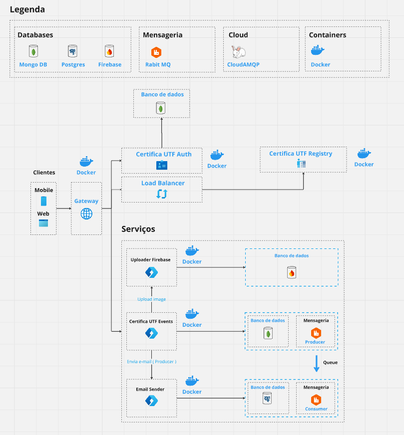

## Feramentas

### Banco de dados

- Mongo DB
- Postgres
- Firebase

### Mensageria

- Rabit MQ

### Cloud

CloudAMPQ

### Front-end

| Nome | Link |
| ------ | ------ |
| Mobile | https://github.com/OficinaDeSoftware/certifica-utf-mobile-front-end |
| Web | https://github.com/OficinaDeSoftware/certifica-utf-front-end |

### Back-end

| Nome | Link |
| ------ | ------ |
| Gateway | https://github.com/OficinaDeSoftware/certifica-utf-gateway |
| Registry | https://github.com/OficinaDeSoftware/certifica-utf-service-registry |
| Email Sender | https://github.com/OficinaDeSoftware/email-sender |
| Firebase Uploader | https://github.com/OficinaDeSoftware/uploader |
| Certifica UTF Events | https://github.com/OficinaDeSoftware/certifica-utf-back-end |
| Certifica UTF Auth | https://github.com/OficinaDeSoftware/certifica-utf-auth |

### Flow

